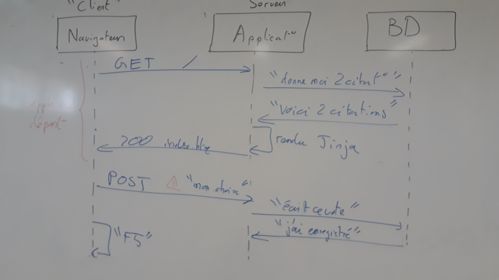

Projet de programmation 2021 à l'UNC
====================================

Description de la séance #02 du 22/02/21.

Objectif
--------

* préciser les périmètres fonctionnels des différentes versions du projet
* prévoir les outils utiles à leur réalisation

Préparation
-----------

Travail à faire **avant** la séance :

* envoyer par mail l'URL du dépôt Github
* tester que tous les membres aient accès en écriture sur le dépôt

Travail à faire
---------------

### Spécification, conception et plannification

* faire la liste **exhaustive** des fonctionnalités attendues
  - si besoin, intéragir avec le client pour valider le besoin
* faire un [**diagramme de séquence**](https://fr.wikipedia.org/wiki/Diagramme_de_s%C3%A9quence) pour décrire les échanges qui ont sur la page principale quand elle s'affiche puis qu'on choisit une des citations depuis un navigateur.

### Lancer l'application de départ

Le dossier [`mini-app`](../mini-app/) contient une application Flask minimaliste qui se lance simplement avec `python3 app.py`.
A ce stade là, on veut essentiellement s'assurer que l'environnement de travail est fonctionnel et que les bases de web sont maîtrisées.

* copier l'application de départ `mini-app` dans votre propre dépôt Github
* lancer l'application `mini-app` avec la commande `python3 app.py` sur votre poste de travail puis la tester avec un navigateur en cliquant sur les personnages.

#### Questions de compréhension

Pour chacune des questions suivantes, justifier en donnant le fichier et les numéros de ligne de code correspondantes :

* où le titre de l'application est-t'il défini ?
* où les messages de la console JavaScript du navigateur (touche **F12**) sont-ils générés ?
* où les messages de la console Python sont-ils générés ?
* qui télécharge le texte des citations : le client ou le serveur ?
* qui télécharge les images qui illustrent les personnahes des citations : le client ou le serveur ?
* comment les citations sont elles mises en deux colonnes dans la page ?
* qui peut se connecter à votre serveur web ? Vérifier avec un camarade de la salle.
* comment s'appelle la fonction qui permet de _"remplir"_ un template Jinja ?
* l'application utilise une API publique pour les citations. Dans quel format les citations sont-elles renvoyées ?

Notes en séance
---------------

Diagramme de séquence au tableau :

